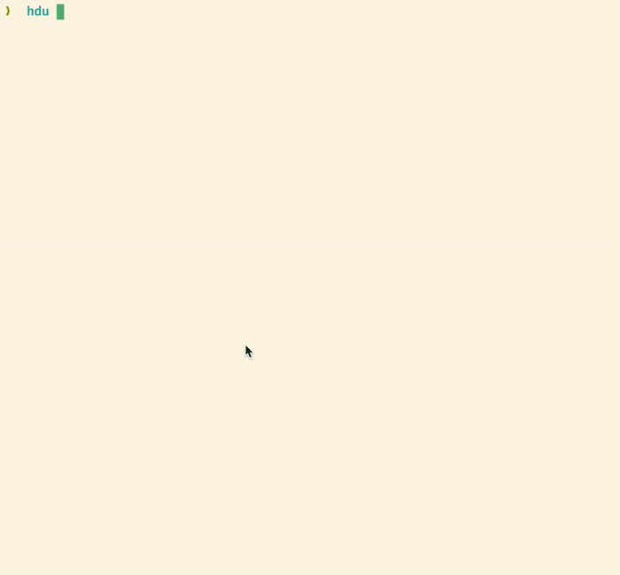

<h1 align="center">
Human friendly du (disk usage) 💾
</h1>

<p align="center">
`hdu` will help you to better understand what folders take up the most space on your computer 💻
</p>

</img>

## Quick Start

1. Install [Node.js](https://nodejs.org/en/download/package-manager) or [Bun.sh](https://bun.sh/docs/installation).
2. Run `npx hdu` or `bunx hdu`.

## Usage

```
Usage: hdu [options] [dirs...]

Human friendly "du" (disk usage) utility.

Arguments:
  dirs                 one or more directories (default: ".")

Options:
  -v, --version        print version
  -f, --include-files  include files
  -s, --sort <order>   sort order (choices: "desc", "asc", default: "desc")
  --head <n>           print first <n> lines
  -h, --help           display help for command

Examples:
  $ npx hdu

  By default, it displays the information about the current
  directory.

  $ npx hdu -f

  The "--include-files" option will display information about
  files too.

  $ npx hdu -s asc

  By default, information will be sorted in descending order.
  You could change the order with the "--sort" option.

  $ npx hdu --head 5

  The "--head <n>" option allows the display first <n> results.
  ```
